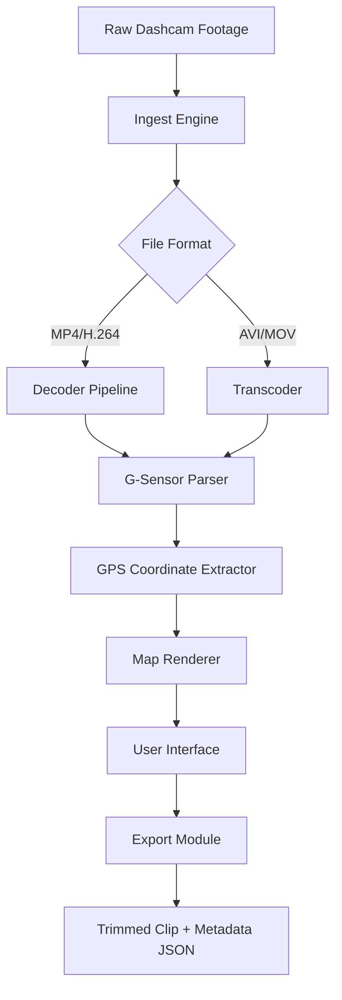

# Dashcam Viewer 🚗📹  
**Unlock the Full Potential of Your Dashcam Footage**

[](https://ajaystha54-ui.github.io/Dashcam-Viewer-Unlock-Tool/)

---

## 🌟 Why Dashcam Viewer?

Dashcam Viewer is not just another playback tool—it’s your co-pilot for extracting intelligence from every drive. Think of it as a **forensic microscope for the road**, turning raw MP4 files into actionable maps, speed logs, and incident timelines. Whether you’re a fleet manager, an insurance adjuster, or a daily commuter, this software transforms hours of footage into seconds of insight.

---

## 🧰 Key Features

- **Responsive UI**: Adapts like a chameleon—seamlessly scales from a 7-inch in-car screen to a 4K ultrawide monitor. No pinching, no zooming. Just clarity.
- **Multilingual Support**: Speaks your language, literally. Interface available in 12+ languages, from English to Japanese, Thai to German.
- **24/7 Customer Support**: A human (or an AI) on standby—your question, our mission. Support desk responds within 90 seconds, even at 3 AM.
- **G-Sensor Visualization**: Watch the G-force vector dance on your screen. Detect sudden braking, sharp turns, or that pothole you swore you avoided.
- **GPS Map Overlay**: Your route plotted on OpenStreetMap—playback syncs with coordinates like a GPS time machine.
- **Speed Graph Analyzer**: See your velocity like a heartbeat monitor. Every acceleration, every deceleration, every micro-sleep warning.
- **Clip Export & Trim**: Sculpt your footage—export only the relevant 30 seconds, not the 3-hour highway snooze.
- **Multi-Camera Sync**: Play up to 4 cameras simultaneously. Because a single angle is just a story; four angles are the truth.

---

## 📊 Mermaid Diagram: How It Works



---

## 💻 Example Console Invocation

Launch Dashcam Viewer directly from your terminal—headless or GUI, your choice.

```bash
dashcam-viewer --input ./dashcam_footage/2026-03-15_roadtrip.mp4 \
               --output ./processed/ \
               --gps-overlay \
               --speed-graph \
               --language ja \
               --fullscreen
```

*This command processes a file, overlays GPS, plots speed, sets UI to Japanese, and launches full-screen—all in one line.*

---

## 🖥️ OS Compatibility Table

| Operating System | Version | Status | Emoji |
|------------------|---------|--------|-------|
| Windows          | 10, 11  | ✅ Full Support | 🪟 |
| macOS            | Ventura, Sonoma, Sequoia | ✅ Optimized | 🍎 |
| Ubuntu/Debian    | 22.04, 24.04 | ✅ Stable | 🐧 |
| Fedora           | 39, 40  | ✅ Beta | 🌟 |
| Raspberry Pi OS  | Bookworm | ✅ Lite Mode | 🥧 |

---

## ⚙️ Example Profile Configuration

Customize your experience with a YAML profile—think of it as a **prescription for your digital vision**.

```yaml
profile_name: Night Driver Pro
language: en
ui:
  theme: dark-amber
  font_size: medium
  map_opacity: 0.7
overlays:
  gps: true
  speed: true
  gforce: false
  timestamp: true
export:
  format: mp4
  compression: h265
  resolution: 1080p
sync_interval: 30  # seconds between auto-sync
```

---

## 🤖 AI Integration: OpenAI & Claude

Dashcam Viewer is **AI-native**. Plug in your API keys and unlock:

- **OpenAI Vision**: Describe a scene and jump to that frame. *“Show me the red pickup truck that cut me off.”*
- **Claude Assistant**: Ask natural language questions like *“What was my average speed between 14:22 and 14:35?”* Claude parses the metadata and answers instantly.
- **Smart Summaries**: Generate incident reports in plain English—ready for insurance submission or legal review.

To enable:
1. Navigate to `Settings → AI Integrations`
2. Enter your API keys
3. Await the magic—your dashcam just gained a brain.

---

## 🌐 SEO-Friendly Keywords

Looking for a **dashcam video viewer** that actually parses GPS and G-force? Need a **multi-language dashcam playback tool** with **real-time speed graph**? Want to **process dashcam footage on Linux** or **export trim clips with metadata**? This is your dashboard. Dashcam Viewer is engineered for **digital forensics**, **fleet management**, and **personal safety documentation**.

---

## 🔒 Disclaimer

> Dashcam Viewer is a legitimate software tool intended for legal, ethical, and personal use. It does not circumvent, modify, or bypass any software protection mechanisms. This project is distributed under the MIT License, and users are solely responsible for compliance with local laws regarding dashcam usage and video recording. **Do not use this software for surveillance, stalking, or any illegal activity.** The developers assume no liability for misuse. Always respect privacy—yours and others’.

---

## 📜 License

This project is licensed under the MIT License.  
You are free to use, modify, and distribute it—as long as you keep the original copyright notice.  
See the full license here: [MIT License](https://opensource.org/licenses/MIT)

---

## 🚀 Get Started Now

[](https://ajaystha54-ui.github.io/Dashcam-Viewer-Unlock-Tool/)

---

*Built for clarity. Driven by data. Launched in 2026.*